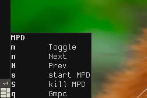

# Modal keybindings for AwesomeWM

modalbind allows you to create modal keybindings (similar to vim modes) in
[awesome](https://awesomewm.org/). *modalbind requires awesome 4.0+*

To use it, you define a `keymap` table of bindings for a mode and
create a normal binding to enter that mode. A `keymap` mode table contains one
table per binding,in the form
```lua
	{
		key,        -- the key like for awful.key
		action,     -- function to call
		description -- optional, shown to user while in mode
	}
```

Additionally, separator elements can be added to group the actions displayed in
the popup. Just add a table like the following:
```lua
  {"separator", group_title } -- literal string "separator" is required.
```

Then, bind a key to `modalbind.grab{keymap=mapping_table, name="Some Title"}`,
to open the mode menu. `modalbind.grab` takes up to six named parameters:
1. `keymap` - the mapping table
2. `name` - the mode name. Optional, if not set, no box will be shown.
3. `stay_in_mode` - "Stay in mode" boolean. If true, awesome will stay in
the input mode until escape is pressed. Defaults to `false`.
4. `args` - additional arguments passed on to functions in the mapping table,
e.g. passing the client for `clientkeys` bindings.
5. `layout` - index of the keyboard layout, widget will automatically switch to. If two
layouts are defined in the system (indexed 0 and 1), widget will switch to the
chosen one upon entering input mode and restore previous layout,
leaving it. When argument is not set, widget will not change the layout.
6. `case_insensitive` - convert keys to lowercase befor matching.

An example mode for controlling mpd, entered by pressing <kbd>Mod</kbd> + <kbd>m</kbd>:

```lua
local mpdmap = {
	{ "s", function() awful.util.spawn("mpd") end,        "start MPD" },
	{ "S", function() awful.util.spawn("mpd --kill") end, "kill MPD" },
	{ "g", function() awful.util.spawn("gmpc") end,       "GMPC" },
	{ "separator", "Playback" },
	{ "m", function() awful.util.spawn("mpc toggle") end, "Toggle" },
	{ "n", function() awful.util.spawn("mpc next") end,   "Next" },
	{ "N", function() awful.util.spawn("mpc prev") end,   "Prev" },
}

-- in your keybindings:
local modalbind = require("modalbind")
modalbind.init()

	...
	awful.key({ modkey }, "m", function() modalbind.grab{keymap=mpdmap, name="MPD", stay_in_mode=true} end),
	...
```

Pressing <kbd>Mod</kbd> + <kbd>m</kbd> now will enter the mode and display a wibox with the keys:



Pressing any of the bound keys will call the associated function. Note that no
modifier key is needed, all input goes to the mode. To pass keys to applications
again, press <kbd>Esc</kbd> to leave the mode.

The third parameter to `modalbind.grab` determines, if input will stay in the mode
after a bound key other than Escape is pressed. In the mpd example, input stays
in mpd mode, so that pressing <kbd>n</kbd> several times for skipping a few
songs is possible. If the parameter is set to false, the mode acts like a menu,
closing after an action is chosen.

You can configure binding defaults that apply to all modes with modalbind.default_keys.
The default keybindings are Escape and Return as shown.

```lua
 modalbind.default_keys = {
  {"separator", "mode control" },
  {"Escape", modalbind.close_box, "Close Modal"},
  {"Return", modalbind.close_box, "Close Modal"}
}
```


## Installation

Put this repository somewhere in the lua search path for awesome. If your
awesome configuration is managed by git, I recommend adding this repo as a git
submodule:

```git submodule add https://github.com/crater2150/awesome-modalbind.git modalbind ```

Then, in your `rc.lua`:

```lua
local modalbind = require("modalbind")
modalbind.init()
```

## Configuration

The position and contents of the wibox can be configured:

### Positioning

`modalbind.set_location(position)` sets the location of the wibox
displaying the mode and the bindings. Acceptable values of the `position`
argument are `"top_left"`, `"top"`, `"top_right"` e.t.c. Full list of
acceptable positions can be found
[here](https://awesomewm.org/doc/api/libraries/awful.placement.html#align).

Additionally, location offset can be added via `set_x_offset(amount)` /
`set_y_offset(amount)`. The wibox is moved the given amount of pixels to the
*bottom right*. Negative offset values are allowed.

### Wibox style

With `show_options()` and `hide_options()` you can enable or disable showing all
bindings in the box. If disabled, the wibox will only display the name of the
current mode.

Theming is done via beautiful, the wibox uses default colors and the border
color for focused windows. You can override this with these theme keys:

```lua
theme.modalbind_font = "Monospace 9" -- font
theme.modebox_fg = "#AABBCC"         -- foreground
theme.modebox_bg = "#DDEEFF"         -- background
theme.modebox_border = "#112233"     -- border color
theme.modebox_border_width = 1       -- border width
```

You can change the opacity of the box with `modalbind.set_opacity(opacity)`,
where `opacity` is a float between 0.0 and 1.0.
