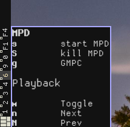

# Modal keybindings for AwesomeWM

modalbind allows you to create modal keybindings (similar to vim modes) in
[awesome](https://awesomewm.org/). *modalbind requires awesome 4.0+*

To use it, you define a table of bindings for a mode and create a normal binding
to enter that mode. A mode table contains one table per binding, in the form
```lua
	{
		key,        -- the key like for awful.key
		action,     -- function to call
		description -- optional, shown to user while in mode
	}
```

An example mode for controlling mpd, entered by pressing <kbd>Mod</kbd> + <kbd>m</kbd>:

```lua
local mpdmap = {
	{"m", function() awful.util.spawn("mpc toggle") end, "Toggle" },
	{"n", function() awful.util.spawn("mpc next") end,   "Next" },
	{"N", function() awful.util.spawn("mpc prev") end,   "Prev" },
	{"s", function() awful.util.spawn("mpd") end,        "start MPD" },
	{"S", function() awful.util.spawn("mpd --kill") end, "kill MPD" },
	{"g", function() awful.util.spawn("gmpc") end,       "GMPC" },
}

-- in your keybindings:
local modalbind = require("modalbind")

	...
	awful.key({ modkey }, "m", function() modalbind.grab(mpdmap, "MPD", true) end),
	...
```

Pressing <kbd>Mod</kbd> + <kbd>m</kbd> now will enter the mode and display a wibox with the keys:



Pressing any of the bound keys will call the associated function. Note that no
modifier key is needed, all input goes to the mode. To pass keys to applications
again, press <kbd>Esc</kbd> to leave the mode.

The third parameter to `modalbind.grab` determines, if input will stay in the mode
after a bound key other than Escape is pressed. In the mpd example, input stays
in mpd mode, so that pressing <kbd>n</kbd> several times for skipping a few
songs is possible. If the parameter is set to false, the mode acts like a menu,
closing after an action is chosen.

## Installation

Put this repository somewhere in the lua search path for awesome. If your
awesome configuration is managed by git, I recommend adding this repo as a git
submodule:

```git submodule add https://github.com/crater2150/awesome-modalbind.git modalbind ```

Then, in your `rc.lua`:

```local modalbind = require("modalbind")```

## Configuration

The position and contents of the wibox can be configured:

### Positioning

`modalbind.set_location(horizontal, vertical)` sets the location of the wibox
displaying the mode and the bindings. `horizontal` and `vertical` can be
numbers, in which case the positioning is absolute, or `"left" / "right" /
"center"` (horizontal) `"top" / "bottom" / "center"` (vertical), in which case
the position is calculated based on the screen geometry and the wibox size.

Combining relative and absolute positioning is possible, so you can have a wibox
on the bottom at 123px from the left with `set_location(123, "bottom).

For convenience, there are additional methods for setting an offset in addition
to a relative position, `set_x_offset(amount)` / `set_y_offset(amount)`. The
wibox is moved the given amount of pixels *away from the border*, e.g. down for
`top` but up for `bottom`. For `center` the box is moved right / down. The
offsets are ignored, if the location was set to an absolute value.

### Wibox style

With `show_options()` and `hide_options()` you can enable or disable showing all
bindings in the box. If disabled, the wibox will only display the name of the
current mode.

Theming is done via beautiful, the wibox uses default colors and the border
color for focused windows. You can override this with these theme keys:

```lua
theme.modebox_fg = "#AABBCC"     -- foreground
theme.modebox_bg = "#DDEEFF"     -- background
theme.modebox_border = "#112233" -- border color
theme.modebox_border_width = 1   -- border width
```

You can change the opacity of the box with `modalbind.set_opacity(opacity)`,
where `opacity` is a float between 0.0 and 1.0.
